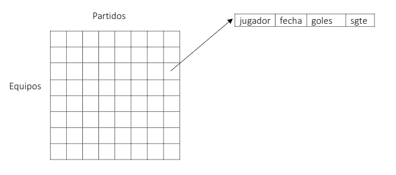

# Segunda Parte TP Anual de Algoritmos y Estructura de Datos 2018

## Presentación

El objetivo de esta segunda parte es poner en práctica el concepto de Estructuras dinámicas y la combinación de éstas con otras estructuras vistas en la primera parte.

## Ejercicios

### Ejercicio 1

Desarrolle una función para generar un archivo binario con el siguiente diseño, con un registro por cada gol realizado en el mundial: 

| id_gol | cod_equipo | fecha    | nombre_jugador  | id_partido |
|--------|------------|----------|-----------------|------------|
| (int)  | (1..32)    | aaaammdd | (20 caracteres) | (1..64)    |

El archivo debe generarse ordenado por los campos cod_equipo y fecha. Teniendo en cuenta que en el mundial se juegan 64 partidos y compiten 32 equipos.

### Ejercicio 2

Se requiere de una funcionalidad que a partir del procesamiento del archivo se informe por pantalla:

- La cantidad de goles por equipo, indicando el nombre del equipo y la cantidad de goles. ¿Cuál es el patrón algorítmico más adecuado para recorrer y procesar el archivo?
- Un listado con los goleadores por cada fecha y otro con los goleadores del mundial,indicando el nombre de jugador, el equipo y la cantidad de goles. 

Por razones de optimización en el uso de recursos computacionales solo se permite una lectura secuencial del archivo generado, para proceder a volcar los datos en un array de 2 dimensiones como se puede apreciar en la imagen siguiente:

Donde cada elemento de la matriz es un puntero a una lista enlazada, donde a su vez cada nodo contiene el nombre del jugador y la cantidad de goles que realizó en una fecha determinada. 

Desarrollar un algoritmo para insertar los datos en la matriz, recorrer las estructuras e imprimir por pantalla los listados solicitados.

### Ejercicio 3

Emitir el listado de goles por equipo del punto anterior,indicando el nombre del equipo y la cantidad de goles, ordenado por cantidad de goles utilizandoun árbol binario de búsqueda. Se deberán cargar los datos en el mismo y recorrerlo INORDER.